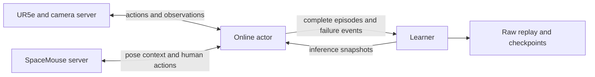

# Runtime and data contracts

Four processes separate hardware interaction from learning:



| Link | Default port | Receiver |
| --- | --- | --- |
| Robot requests | 7001 | Robot server |
| Robot observations | 7008 | Actor / recorder / validator |
| Operator requests | 7002 | SpaceMouse server |
| Operator responses | 7003 | Actor / recorder |
| Training episodes | 7003 | Learner on a separate host |
| Policy snapshots | 7004 | Actor |

Transport uses `shared.zmq.Sender` (PUSH) and `Receiver` (PULL).
Task loading imports `tasks.<name>.<component>` dynamically. Learner-only paths
do not construct robot drivers. Inference uses `shared.actor_network` and does
not import the learning algorithm.

## Observations and actions

Three RGB images pass through a frozen ImageNet ResNet-18, yielding three
512-dimensional embeddings. Normalized TCP velocity (6), wrench (6), gripper
opening (1), and projected gravity (3) give 1552 total observation dimensions.
TCP pose is available locally for control/reset and is omitted from replay's
policy observation. RGB-D crops are also used by separate success classifiers.

The actor normalizes observations deterministically before transport. Replay
keeps raw uint8 images, caches one encoded observation per physical transition,
and generates Gaussian feature noise during updates. Action dimensions are
task-specific (3, 4, or 5 in the paper task profiles), normalized to [-1, 1].
The robot adapter converts these to Cartesian targets and gripper commands.

An episode is a list of transitions:

```python
{
    "raw_obs": {"images": ..., "tcp_speed": ..., "tcp_force": ...,
                "gripper": ..., "projected_gravity": ...},
    "raw_action": {"delta_pos": ..., "delta_rot": ..., "gripper": ...},
    "reward": float,
    "done": bool,
    "info": {"is_intervene": bool, ...},
}
```

Intervened rows also preserve the unexecuted `autonomous_action` in `info`.
Successful terminals do not bootstrap. Timeouts end collection but retain
`raw_next_obs` for finite-horizon learning. Explicit failures set
`unrecoverable_next` and retain the next observation; pre-action failure events
carry the failed state without inventing an executed transition.

## Replay and snapshots

All executed transitions enter the main replay. Human-action indices include
all intervention steps; successful-human-suffix indices support reference
learning. These sets have different meanings and sampling rules.

Raw replay lives in `outputs/<experiment>/buffer/*.pkl`. Checkpoints contain
networks, optimizers, counters, algorithm state, and a replay watermark, but do
not duplicate raw replay. A background writer atomically publishes checkpoints
after an immutable CPU snapshot and replay flush. The default interval is
120 seconds of cumulative learner runtime.

Inference snapshots carry architecture metadata, mechanism encoder weights,
actor weights, and the output activation. The actor applies updates between
episodes and can save the exact network used by each episode. H, IQL, critics,
and optimizers are learner-only. Validation loads compact actor snapshots and
stores independent results without sending them to training.
